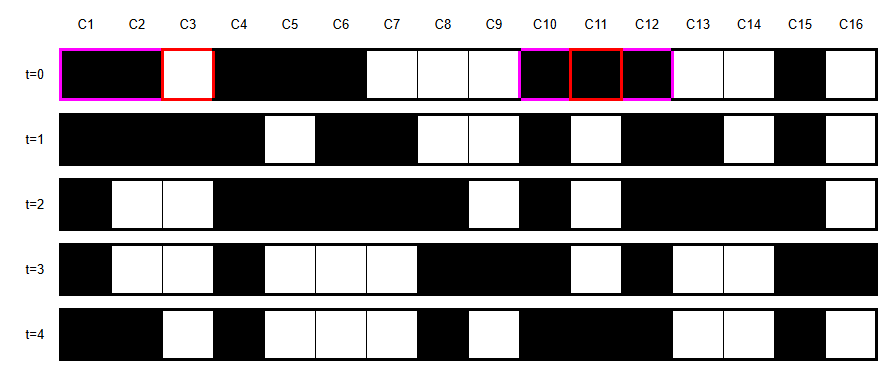
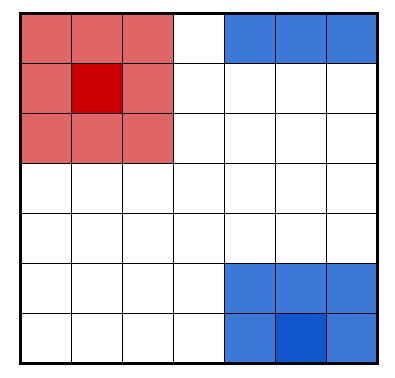
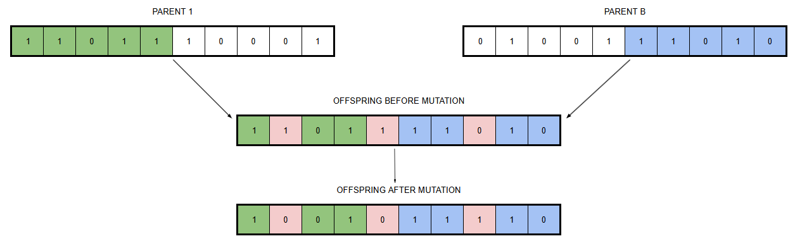

# Exploring Cellular Automata: Deterministic and Evolutionary Approaches

Objective: Programming cellular automata using deterministic rules and finding new rules using evolutionary approches. 

Plan:
1. Description of cellular automata
2. A deterministic approch: Conway's Game of Life
3. An evolutionary approch: improving the search of rules
4. Applications:
    4.1 Modeling fluid dynamics
    4.2 Finding the best rule

## What are cellular automata?

Cellular automata (CA) are discrete spatial systems introduced by John Von Neumann in 1940s. They consist of a finite number of cells evolving through time according to a set of predefined rules. Figure 1 illustrate the evolution of a 1D cellular automaton. In this example, the CA is represented by a vector of 16 cells, but depending on the model, a 2D or even 3D grids may be used. Each cell of the vector takes a value (or state) from a finite set; 0 (white) or 1 (black) in our case. At each time step, the state of each cell updated based on its neighbouring cells. In the example below, the rules are:
1. If a cell `n` is in state 0 and the two previous cells (n-1 and n-2) are in state 1, then cell n becomes 1 at the next step (example: cell C3 at t=0)
2. If a cell n is in state 1 and its two adjacent neighbors (n-1 and n+1) are also in state 1, then cell n becomes 0 at the next time step (example: cell C11 at t=0)

  
**Figure 1**: Evolution of a 1D cellular automaton through time.

In the rest of this project, we mainly focus on 2D grids with two possible states (0 or 1). Each cell's neighborhood includes the 8 surrounding cells, as shown in red in Figure 2. This raises a boundary issue for the cells located on the edges of the grid. Various approaches exist to address this, and in this project, we chose to model the grid as a torus. For example, the bottom neighbors of the last row are the cells of the first row (see Figure 2 in blue), and the same logic applies to the columns.

  
**Figure 2**: Two target cells and their neighbours. In red, the immediate neighbors; in bleu, neighbors unter the torus assumption.

## Conway's Game of Life

A very popular cellular automaton is the one used in the *Game of Life*. *Life*, or the *Game of Life* was defined by John Conway in the 1960s. 

In this model, each cell lives or dies depending on the state of its neighbours, according to rules that simulate underpopulation and overpopulation:
- a living cell dies if it has fewer than two living neighbours (underpopulation);
- a living cell dies if it has more than three living neighbours (overpopulation);
- a dead cell becomes alive if it has exactly three living neighbours (reproduction)

The interest of this model lies in the evolution of the automaton from an initial state, particularly in the emergence or persistence of specific patterns.

## Searching for rules with genetic algorithms

In the previous section, the rule used for the cellular automata was predefined. Here,we approach the problem from the opposite direction: we are given a target pattern, and the goal is to find a rule that can reproduce it exactly, or at least approximate it closely. One method would be to test all possible rules, but this is computationally expensive. A more efficient approach is to use a genetic algorithm.

A genetic algorithm is a search technique for optimal solutions, introduced by John Holland in the 1970s. It starts with an initial population of individuals whose fitness is tracked over time. The population evolves through natural selection meaning that only a subset of individuals is selected for reproduction. Each individual is defined by a chromosome, thus the offsping ate generated by combining parts of the parents' chromosome, an equivalent to crossover, and subjected to random mutation. The crossover and mutation processes are illustrated in the photo below.

**Figure 3**: Illustration of crossing-over and mutation on the generation of an offspring chrosome from its two parents.

How does that relate to our problem? Each individual represents a rule encoded in its chromosome. Selection favours rules according to their performance. New rules are generated by combining two rules, and randomly alter to prevent the algorithm getting stuvk in local optima. The key challenge of this method is to define an effective evalutation function and an appropriate encoding scheme to to represent a list of rules into a chromosome-like vector.

As one might expect, this method draws heavy inspiration from evolutionary biology. Therefore, we will approch this section through the lens of a biologist, exploring how mutation rate, recombination and selection affect the mean fitness of the population.

## Applications
After their introduction in computer science, cellular automata (CA) have been widely used in the physical and natural sciences to model phenomena such as galaxy formation, disease epidemics, and wildfires.

In this section, we use cellular automata in two distinct applications:
- to model the dynamic of a steady fluid flow represented by square particles,
- in combination with a genetic algorithm, to search for specific spatial patterns.

# Conclusion: Why use CA?
Wolfram states that, compared to mathematical moddels such as differential equations, CA may serve as a clearer and more accurate framework for modeling complex natural phenomena. While mathetical models give an average description of a system's behavious, they cannot account for its individuals properties. In addition, the transition rules in CA are more comprehensive and their correspondance to the phenomenon are more straightforward. However, CA and mathematical models are complementary as CA shows global behaviour arising from individual behaviour.

In field data, we never observe all possible initial conditions. Data oriented model often give very good predictions (ex: Shugart's Foret model)

While most real-world applications of cellular automata rely on manually designed rules, such rules often originate from exploratory work — where a large number of possible rule sets are tested and evaluated. By evolving CA rules with a genetic algorithm, we aim to identify rule sets that produce desired behaviors (e.g., stability, propagation, speed). These experiments can lay the groundwork for future applications by narrowing down effective rule patterns.

# Bibliography

Argentini, G. (2003). A first approach for a possible cellular automaton model of fluids dynamics. arXiv preprint cs/0303003.

Cerruti, U., Dutto, S., & Murru, N. (2020). A symbiosis between cellular automata and genetic algorithms. Chaos, Solitons & Fractals, 134, 109719.

Grieshop, N., & Wikle, C. K. (2024). Data-driven modeling of wildfire spread with stochastic cellular automata and latent spatio-temporal dynamics. Spatial Statistics, 59, 100794.

Hogeweg, P. (1988). Cellular automata as a paradigm for ecological modeling. Applied mathematics and computation, 27(1), 81-100.

Itami, R. M. (1994). Simulating spatial dynamics: cellular automata theory. Landscape and urban planning, 30(1-2), 27-47.

Maddox, J. (1987). The universe as a fractal structure. Nature, 329(6136), 195.

Whitley, D. (1994). A genetic algorithm tutorial. Statistics and computing, 4(2), 65-85.
